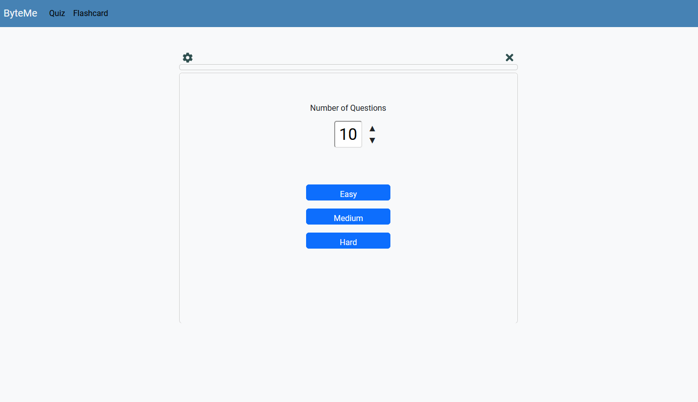
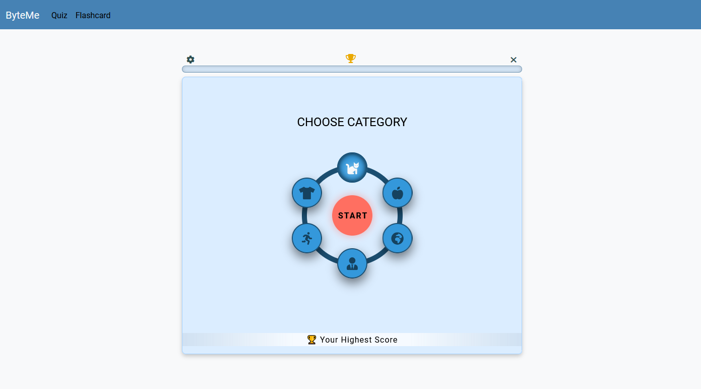

# Game Hub

## Overview

Game Hub is a collection of short games that utilize free APIs. Currently, it features two games: Trivia Quiz and Flashcard / Hangman.

## Technologies Used

- APIs: OpenTDB, Pexels
- jQuery, Bootstrap

## Screenshot

*A snapshot of the Trivia Quiz interface with a clean, user-friendly design.*

*A snapshot of the Flashcard interface with a clean, user-friendly design.*

## Features

- **Trivia Quiz:**
  - Questions generated from a trivia API.
  - Each round gives the player 30 seconds to answer a question by choosing from a selection of 4 multiple-choice answers.

- **Flashcard / Hangman:**
  - A combination of Hangman and Pictionary-style game.
  - Offers a variety of topics to choose from.
  - Players have to guess the picture by typing in letters and have three chances to enter the word correctly.
  
## How to Use It

1. Clone the repository.
2. Open the respective HTML files for Trivia Quiz and Flashcard.
3. Explore the games and enjoy the interactive experience.
4. Alternatively, you can use the Trivia Quiz and Flashcard directly simply navigate to the [GitHub Pages](https://saif-uddin-93.github.io/flash-card-trivia/).

## Challenges

- GitHub code conflicts and commit issues.
- API limitations, paywall, and restricted number of calls for testing.
- Limited APIs for initial idea (JS interview questions).
- Insufficient team members to divide tasks effectively.

## Successes

- Agreement on splitting tasks to avoid code conflict issues.
- Implementation of our ideas, resulting in two unique games.

## Future Enhancements

- Add a variety of games.
- Implement the ability to export/import saved local storage data or save on server storage.
- Introduce multiplayer games.

## Credits

- Marcin Tatarski (GitHub: [martindocs](https://github.com/martindocs/flash-card-game/tree/main))
- Saif Uddin (GitHub: [Saif-Uddin-93](https://github.com/Saif-Uddin-93/flash-card-trivia))

## License

Please refer to the [LICENSE](./LICENSE.md) file in this repository for details on how this project is licensed.
